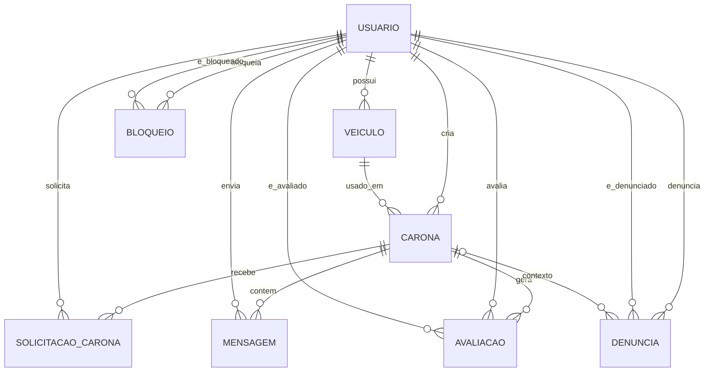

# Modelo de dados

Modelagem inicial e consistente com o MVP acadêmico do UnBlaBlaCar. O objetivo
é descrever as entidades e regras de negócio, sem implementar banco de dados ou
código.

## Escopo do modelo no MVP

Este modelo cobre:

- autenticação institucional e perfil de estudante;
- cadastro de veículo;
- publicação de carona;
- solicitação e aceite de vaga;
- chat temporário entre participantes aceitos;
- avaliação após carona concluída;
- modelagem de denúncia e bloqueio por completude documental.

Observação: as entidades de denúncia e bloqueio estão modeladas para evolução
futura (futuro próximo) e não compõem o núcleo operacional do MVP atual.

## Entidades

### Usuario

Finalidade: representar o estudante autenticado que pode atuar como motorista ou
passageiro.

Campos principais:

- id
- nome
- email_institucional (único)
- email_verificado_em
- foto_perfil (opcional)
- telefone (opcional)
- curso (opcional)
- ativo
- data_criacao

Relacionamentos:

- Usuario 1:N Veiculo
- Usuario 1:N Carona (como motorista)
- Usuario 1:N SolicitacaoCarona (como passageiro)
- Usuario 1:N Mensagem (como remetente)
- Usuario 1:N Avaliacao (como avaliador)
- Usuario 1:N Avaliacao (como avaliado)
- Usuario 1:N Denuncia (como denunciante)
- Usuario 1:N Denuncia (como denunciado)
- Usuario 1:N Bloqueio (como bloqueador)
- Usuario 1:N Bloqueio (como bloqueado)

Cardinalidade importante:

- um usuário pode ter zero ou mais veículos;
- um veículo pertence obrigatoriamente a exatamente um usuário.

### Veiculo

Finalidade: armazenar dados básicos do veículo utilizado pelo motorista.

Campos principais:

- id
- usuario_id (FK obrigatória para Usuario)
- modelo
- cor
- placa
- ativo
- data_cadastro

Relacionamentos:

- Veiculo N:1 Usuario (obrigatório)
- Veiculo 1:N Carona

### Carona

Finalidade: representar uma carona ofertada por um motorista com vagas.

Campos principais:

- id
- motorista_id (FK obrigatória para Usuario)
- veiculo_id (FK obrigatória para Veiculo)
- origem
- destino
- data_hora_partida
- vagas_totais
- vagas_disponiveis
- custo_sugerido
- status (aberta, em_andamento, concluida, cancelada)
- data_criacao

Relacionamentos:

- Carona N:1 Usuario (motorista)
- Carona N:1 Veiculo
- Carona 1:N SolicitacaoCarona
- Carona 1:N Mensagem
- Carona 1:N Avaliacao
- Carona 1:N Denuncia (opcional)

### Solicitacao (SolicitacaoCarona)

Finalidade: representar o pedido de vaga de um passageiro em uma carona.

Observação: esta entidade substitui abordagens de tabela de associação genérica
de passageiros por um modelo com status e histórico de decisão.

Padronização do modelo: o pedido de vaga do passageiro é representado pela
entidade SolicitacaoCarona em toda a documentação do projeto.

Campos principais:

- id
- carona_id (FK obrigatória para Carona)
- passageiro_id (FK obrigatória para Usuario)
- status (pendente, aceita, recusada, cancelada)
- data_solicitacao
- data_resposta (opcional)

Relacionamentos:

- SolicitacaoCarona N:1 Carona
- SolicitacaoCarona N:1 Usuario (passageiro)

### Mensagem

Finalidade: registrar mensagens do chat temporário da carona.

Campos principais:

- id
- carona_id (FK obrigatória para Carona)
- remetente_id (FK obrigatória para Usuario)
- conteudo
- data_envio

Relacionamentos:

- Mensagem N:1 Carona
- Mensagem N:1 Usuario (remetente)

### Avaliacao

Finalidade: registrar feedback entre participantes após a conclusão da carona.

Campos principais:

- id
- carona_id (FK obrigatória para Carona)
- avaliador_id (FK obrigatória para Usuario)
- avaliado_id (FK obrigatória para Usuario)
- nota
- comentario (opcional)
- data_avaliacao

Relacionamentos:

- Avaliacao N:1 Carona
- Avaliacao N:1 Usuario (avaliador)
- Avaliacao N:1 Usuario (avaliado)

### Denuncia

Finalidade: registrar problemas de conduta ou segurança após interação real
entre usuários.

Campos principais:

- id
- denunciante_id (FK obrigatória para Usuario)
- denunciado_id (FK obrigatória para Usuario)
- carona_id (FK opcional para Carona)
- motivo
- descricao (opcional)
- status_analise (aberta, em_analise, concluida)
- data_registro

Relacionamentos:

- Denuncia N:1 Usuario (denunciante)
- Denuncia N:1 Usuario (denunciado)
- Denuncia N:1 Carona (opcional)

### Bloqueio

Finalidade: impedir novas interações diretas entre dois usuários após incidente.

Campos principais:

- id
- bloqueador_id (FK obrigatória para Usuario)
- bloqueado_id (FK obrigatória para Usuario)
- motivo (opcional)
- data_bloqueio
- ativo

Relacionamentos:

- Bloqueio N:1 Usuario (bloqueador)
- Bloqueio N:1 Usuario (bloqueado)

## Regras de relacionamento e integridade

1. Veiculo dependente de Usuario: um veículo não existe sem usuário dono (FK
	obrigatória).

2. Consistência motorista x veículo: uma carona só pode usar veículo pertencente
	ao motorista da própria carona.

Essa regra garante que o Veiculo utilizado na carona pertença obrigatoriamente
ao Usuario que atua como motorista.

3. Unicidade de solicitação por passageiro: um passageiro não pode solicitar a
   mesma carona mais de uma vez. Restrição recomendada: UNIQUE (carona_id,
   passageiro_id).

4. Controle de vagas: solicitação aceita reduz vagas_disponiveis em 1;
	cancelamento de solicitação aceita devolve a vaga.

5. Chat temporário: mensagens só podem ser enviadas por motorista ou passageiros
	com solicitação aceita para a carona.

6. Avaliacao pós-conclusão: avaliação só pode ser criada quando a carona estiver
   com status concluida.

7. Denuncia e bloqueio após interação: denúncia e bloqueio devem ocorrer apenas
	entre usuários que já interagiram em uma mesma carona.

8. Privacidade: telefone pessoal não é obrigatório; endereço residencial completo não deve ser
	armazenado/exposto; placa pode ser exibida parcialmente quando necessário; histórico e
	localização devem ser protegidos e exibidos apenas no contexto necessário da carona.

## Modelo lógico resumido

- Usuario (id PK)
- Veiculo (id PK, usuario_id FK -> Usuario.id)
- Carona (id PK, motorista_id FK -> Usuario.id, veiculo_id FK -> Veiculo.id)
- SolicitacaoCarona (id PK, carona_id FK -> Carona.id, passageiro_id FK ->
  Usuario.id, UNIQUE(carona_id, passageiro_id))
- Mensagem (id PK, carona_id FK -> Carona.id, remetente_id FK -> Usuario.id)
- Avaliacao (id PK, carona_id FK -> Carona.id, avaliador_id FK -> Usuario.id,
  avaliado_id FK -> Usuario.id)
- Denuncia (id PK, denunciante_id FK -> Usuario.id, denunciado_id FK ->
  Usuario.id, carona_id FK opcional -> Carona.id)
- Bloqueio (id PK, bloqueador_id FK -> Usuario.id, bloqueado_id FK ->
  Usuario.id, UNIQUE(bloqueador_id, bloqueado_id))

## Diagrama ER (visão simplificada)

Observação: este é um documento conceitual para planejamento acadêmico; não
representa implementação de código.
