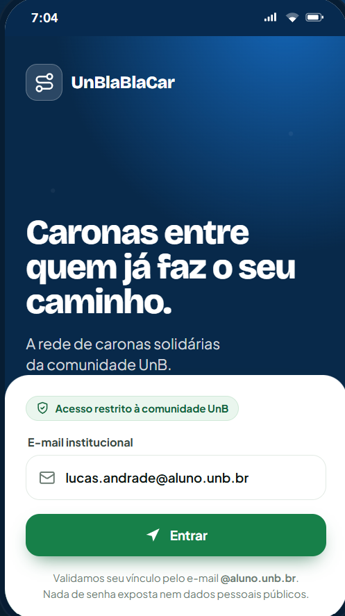
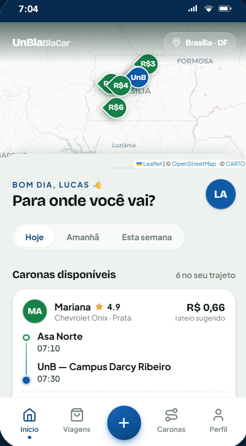
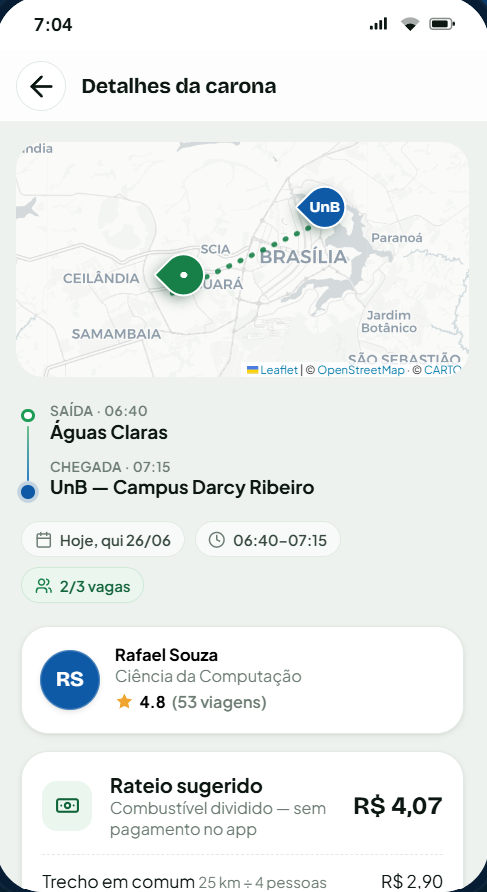
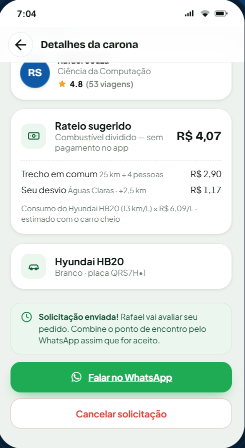
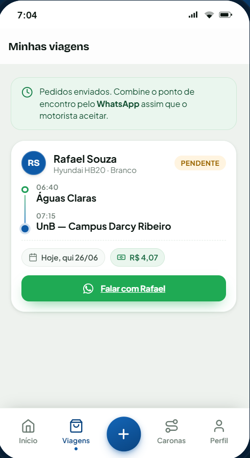
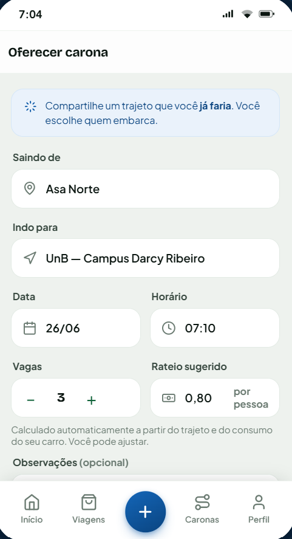
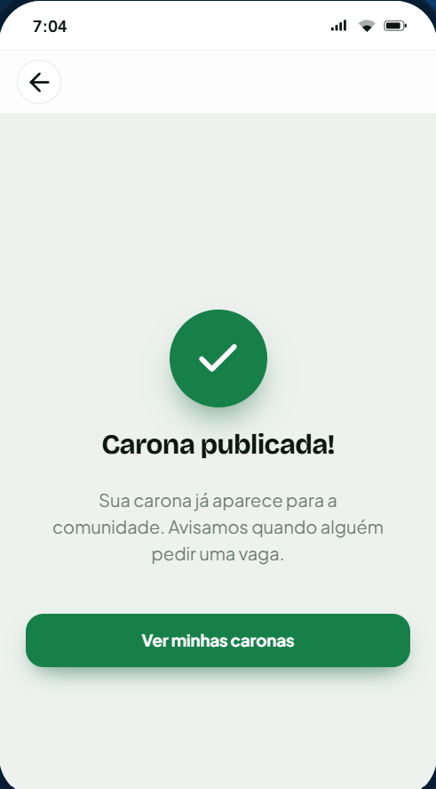
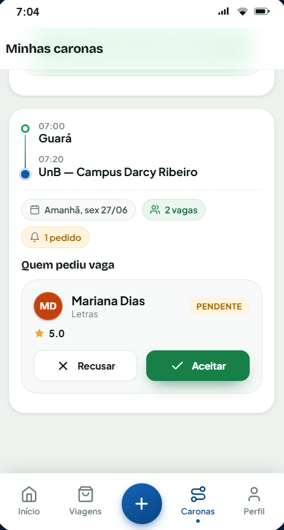
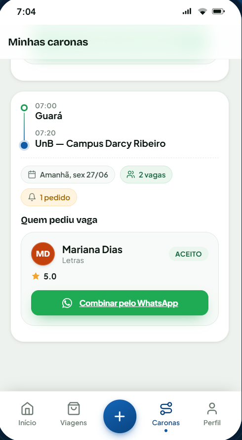
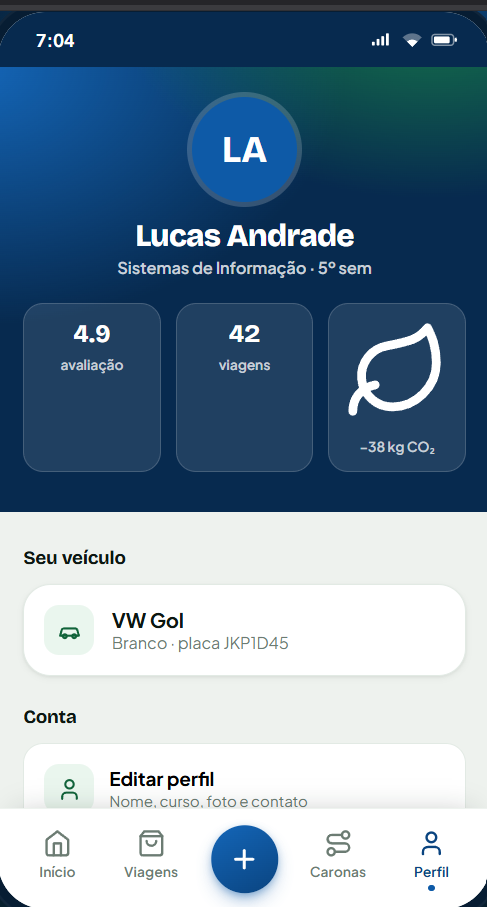

# Protótipo do MVP

## Objetivo

Esta página documenta o protótipo real do MVP da plataforma de caronas da UnB.

Decisão de nomenclatura: a documentação foi padronizada para **UnBlaBlaCar**,
porque esse nome é o mais recorrente no protótipo implementado em
`prototype/` e também aparece na apresentação.

## Onde está o código do protótipo

O código do protótipo está em `prototype/`.

| Arquivo | Função |
|---|---|
| `prototype/index.html` | Estrutura da aplicação e carregamento dos scripts |
| `prototype/assets/css/tokens.css` | Tokens visuais (cores, tipografia e espaçamento) |
| `prototype/assets/css/app.css` | Estilos das telas e componentes |
| `prototype/assets/js/data.js` | Dados fictícios do domínio (usuários, caronas, solicitações) |
| `prototype/assets/js/preco.js` | Regra de cálculo do rateio sugerido |
| `prototype/assets/js/map.js` | Integração do mapa para rota e visão geral |
| `prototype/assets/js/app.js` | Navegação, renderização de telas e interações |

## Como executar localmente

```bash
cd prototype
python -m http.server 5500
```

Abra no navegador:

```text
http://localhost:5500
```

## Fluxo principal do passageiro

Fluxo observado no protótipo:

login -> home com caronas -> detalhes da carona -> solicitação enviada -> minhas viagens.

Histórias relacionadas: **H1, H4, H5 e H7**.

## Fluxo principal do motorista

Fluxo observado no protótipo:

oferecer carona -> carona publicada -> minhas caronas com pedido pendente -> pedido aceito.

Histórias relacionadas: **H3, H5 e H7**.

## Perfil e confiança

O protótipo já representa elementos de confiança por meio de:

- acesso institucional;
- perfil com informações acadêmicas;
- veículo associado ao motorista;
- reputação/avaliações visíveis no perfil.

Histórias relacionadas: **H2 e H8 (parcial)**.

## Limitação atual: comunicação via WhatsApp

No backlog, a história H6 prevê **chat interno temporário**. No protótipo atual,
a comunicação foi simplificada com contato via WhatsApp após o aceite.

Registro de evolução do MVP:

- substituir contato externo por chat interno temporário;
- reduzir exposição de telefone pessoal;
- manter a comunicação vinculada à carona e ao período da viagem.

## Telas do protótipo e vínculo com histórias

### 1) Login institucional

Histórias relacionadas: **H1**



### 2) Home com caronas disponíveis

Histórias relacionadas: **H4**



### 3) Detalhes da carona com rota e rateio

Histórias relacionadas: **H4**



### 4) Detalhes com solicitação enviada

Histórias relacionadas: **H5** e **H6 (parcial)**



### 5) Minhas viagens (passageiro)

Histórias relacionadas: **H7 (parcial)**



### 6) Oferecer carona

Histórias relacionadas: **H3**



### 7) Carona publicada

Histórias relacionadas: **H3**



### 8) Minhas caronas com pedidos

Histórias relacionadas: **H5**



### 9) Minhas caronas com pedido aceito

Histórias relacionadas: **H5**, **H7 (parcial)** e **H6 (parcial)**



### 10) Perfil do usuário

Histórias relacionadas: **H2** e **H8 (parcial)**



## Cobertura das histórias (H1 a H9)

| História | Descrição | Cobertura no protótipo |
|---|---|---|
| H1 | Login institucional | Representada |
| H2 | Perfil e veículo | Parcial |
| H3 | Oferecer carona | Representada |
| H4 | Buscar carona e rateio | Representada |
| H5 | Pedir vaga e receber resposta | Representada |
| H6 | Comunicação/chat temporário | Parcial |
| H7 | Acompanhar/cancelar/concluir carona | Parcial |
| H8 | Avaliações/reputação | Parcial |
| H9 | Denúncia/bloqueio | Planejada |